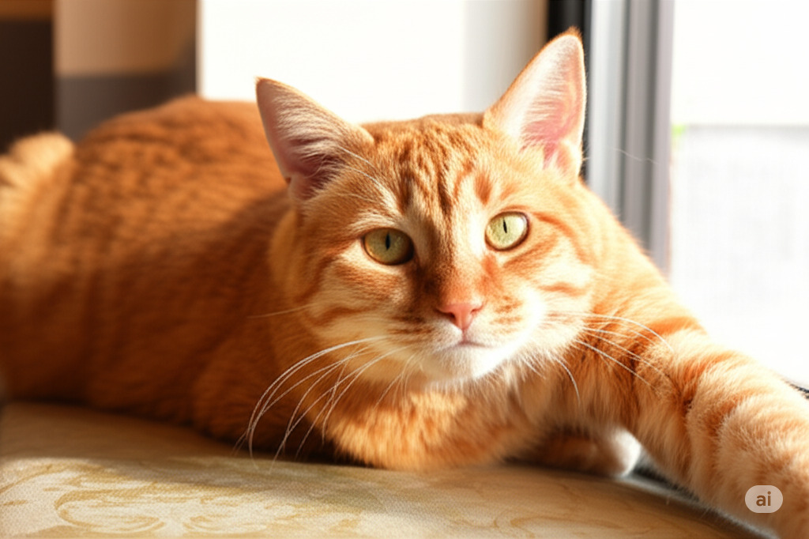

# Multimodal Usage

[Some models](multimodal_model_plugins.md) support multimodal inputs, allowing you to generate embeddings from both text and images. This section describes how to use the `emb` command with multimodal models.

We assume you have installed the `embcli-clip` plugin, which provides access to CLIP models.

```bash
pip install embcli-clip
```

## `embed` command with image inputs

The `emb embed` command can be used to generate embeddings from both text and image inputs. You can specify either a text input, an image file.

Assume you have a image *gingercat.jpeg* in the current directory:



To generate an embedding for the image with a CLIP model, use the `--image` option:

```bash
emb embed -m clip --image gingercat.jpeg
```

The output will be a vector representation of the image.

```
[-0.037693317979574203, -0.009889602661132812, 0.18305328488349915, -0.6573096513748169, -0.11941207945346832, -0.5147519111633301, -0.011547870934009552, ...]
```

## `simscore` command with image inputs

You can also calculate the similarity score between a text and an image using the `emb simscore` command. This is useful for comparing how well a text description matches an image.
To calculate the similarity score between a text and an image, use the `--image` option for the image and provide the text as a file in the command:

```bash
emb simscore -m clip -f1 desc.txt --image2 gingercat.jpeg
```

Where `desc.txt` contains a text description of the image:

```
A ginger cat with bright green eyes, lazily stretching out on a sun-drenched windowsill.
```

Or the text can be provided directly in the command:

```bash
emb simscore -m clip \
"A ginger cat with bright green eyes, lazily stretching out on a sun-drenched windowsill." \
--image2 gingercat.jpeg
```

The output will be a float value representing the similarity score between the text and the image, calculated using the specified metric (default is cosine similarity):

```
0.33982698978267567
```

It is also possible to calculate the similarity score between two images:

```bash
emb simscore -m clip --image1 gingercat.jpeg --image2 blackcat.jpeg
```

## Document Search with Image Input

You can search for documents in a vector store by using an image as the query. To search for documents using an image, use the `emb search` command with the `--image` option:

```bash
# index example documents
emb ingest-sample -m clip -c catcafe --corpus cat-names-en

# search for documents using an image as the query
emb search -m clip -c catcafe --image gingercat.jpeg
Found 5 results:
Score: 0.008130492317462625, Document ID: 14, Text: Milo: Milo is an endlessly curious and adventurous orange tabby, always the first to investigate new sounds or objects. He is incredibly friendly, greeting everyone with enthusiastic meows and leg-rubs. Milo loves interactive toys and will happily follow his humans around, eager to be involved in every household activity.
Score: 0.00806729872159855, Document ID: 54, Text: Jasper (II): Jasper the Second, distinct from his predecessor, is a playful and highly energetic ginger tom. He loves to chase, tumble, and explore every nook and cranny with boundless enthusiasm. Jasper is also incredibly affectionate, always ready for a cuddle after a vigorous play session, a bundle of orange joy.
Score: 0.007995471315075445, Document ID: 8, Text: Oliver (Ollie): Ollie is a charmingly goofy orange tabby, full of curious energy and playful pounces. He’s incredibly friendly, often greeting visitors with a cheerful chirp and a head-butt. He loves food, interactive toys, and will happily follow his humans around, always eager to be part of the action.
Score: 0.007992460725066777, Document ID: 71, Text: Archie: Archie is a friendly and slightly goofy ginger cat, always up for a bit of fun and a good meal. He is very sociable and loves attention from anyone willing to give it. Archie enjoys playful wrestling and will often follow his humans around, offering cheerful chirps and affectionate head-bumps.
Score: 0.007982146864511108, Document ID: 42, Text: Sammy: Sammy is a laid-back and friendly ginger cat, always happy to see you. He enjoys lounging in comfortable spots but is also up for a gentle play session. Sammy is a great companion for a relaxed household, offering quiet affection and a warm, purring presence without demanding constant attention.
```

## Indexing Images using a multimodal model

Coming soon.